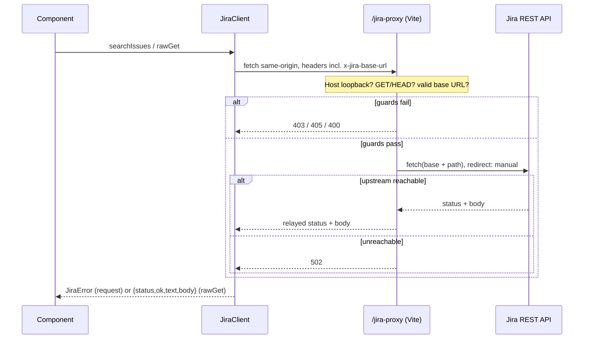

# Jira Data Bridge — Architecture

How the app is wired, for someone who will modify it. For a feature-by-feature reference see
[FUNCTIONALITY.md](./FUNCTIONALITY.md); for the external proxy contract see
[INTEGRATION.md](./INTEGRATION.md).

## Module / dependency map

```
main.tsx                      createRoot + <StrictMode><App/></StrictMode>
  └─ App.tsx                  session + tab + preset state; auto-restore
       ├─ ConnectionForm.tsx  connect form (deployment toggle, URL normalize)
       ├─ IssuesPanel.tsx     JQL search, pagination, CSV/JSON export
       │    ├─ IssueDetail.tsx   modal; getIssue; ADF description
       │    │    └─ StatusChip.tsx
       │    └─ StatusChip.tsx
       ├─ ProjectsPanel.tsx   listProjects, filter, card grid
       └─ ApiExplorer.tsx     endpoint catalog → rawGet

lib/
  jiraClient.ts   JiraClient + JiraError; auth headers, proxy routing, pagination
  endpoints.ts    ENDPOINT_GROUPS + JIRA_ENDPOINTS catalog (types EndpointParam/JiraEndpoint)
  storage.ts      load/save/clearConnection (localStorage)
  export.ts       flattenIssue, toCsv, downloadFile
  adf.ts          descriptionToText (ADF → plain text)
  format.ts       formatDate
types.ts          Deployment, ConnectionConfig, JiraUser, JiraStatus,
                  JiraIssue(Fields), JiraProject, SearchCursor, SearchPage

vite.config.ts    react() + jiraProxyPlugin(): the /jira-proxy middleware (dev & preview)
```

**Who imports what.** Components import `JiraClient` (type-only, except `App` which
constructs it) and the lib helpers they need — `IssuesPanel` pulls `export.ts` +
`format.ts`, `IssueDetail` pulls `adf.ts` + `format.ts`, `ApiExplorer` pulls `endpoints.ts`
+ `export.ts` (for `downloadFile`), `ProjectsPanel` needs no lib beyond the client, and
`App` pulls `storage.ts`. Every lib module and component imports its types from `types.ts`.
`jiraClient.ts` is the only module that knows about the `/jira-proxy` URL and the auth
scheme; nothing else builds a request. The dependency graph is a DAG — no lib imports a
component.

## Request lifecycle, end to end

Every network call — typed methods and the explorer's raw GETs — leaves the browser aimed
at the app's **own origin** under `/jira-proxy`, and the Vite middleware relays it to Jira.

```
 Component (IssuesPanel / ProjectsPanel / ApiExplorer / IssueDetail)
     │  client.searchIssues() / listProjects() / getIssue() / rawGet()
     ▼
 JiraClient.request()  ── builds /jira-proxy/rest/api/{2|3}{path}?{params}
   or   .rawGet()      ── builds /jira-proxy{sitePath}?{query}
     │  headers(): Accept, Authorization (Basic|Bearer), x-jira-base-url
     ▼
 fetch(same-origin /jira-proxy…)          ← browser only ever talks to its own origin
     ▼
 Vite dev/preview server  →  jiraProxyHandler middleware
     │  GUARD 1: Host must be loopback ............... else 403
     │  GUARD 2: method must be GET/HEAD ............. else 405
     │  GUARD 3: x-jira-base-url must parse http(s) .. else 400
     │  forward accept + authorization + content-type only; redirect: 'manual'
     ▼
 fetch(base.origin + basePath + req.url)   ← the real Jira site
     ▼
 Upstream Jira REST API
     │  (unreachable → 502)
     ▼
 relay status + content-type + raw body back to the browser
     ▼
 JiraClient: request() throws JiraError on !ok; rawGet() returns {status,ok,text,body}
     ▼
 Component state → React render
```



## The proxy: why it exists, and its guards

`vite.config.ts` registers `jiraProxyPlugin()`, which mounts `jiraProxyHandler` at the
`/jira-proxy` prefix on **both** the dev server (`configureServer`) and the preview server
(`configurePreviewServer`). It exists because **browsers can't call Jira's REST API
cross-origin** — Jira doesn't send CORS headers — so the client aims every request at its
own origin and the middleware, running server-side, forwards it.

Guards run in this order and short-circuit:

1. **Loopback Host → else 403.** `isLoopbackHost` accepts only `localhost`, `127.0.0.1`, or
   `::1` (handling bracketed IPv6 like `[::1]:5173`). This runs *ahead of* Vite's own
   host-check middleware. The browser sets `Host` from the page origin and JS can't forge
   it, so pinning to loopback defeats **DNS-rebinding** (a page on `attacker.com` rebound to
   `127.0.0.1`) and **`--host` LAN SSRF**.
2. **GET/HEAD only → else 405.** The app is a read-only data bridge; refusing anything that
   could mutate Jira means the guarantee holds **at the relay**, not just in the client's
   endpoint list.
3. **Valid `x-jira-base-url` (http/https) → else 400.** Names the Jira site to relay to.

On a passing request the handler forwards only **`accept`, `authorization`, and
`content-type`** (accept is fixed to `application/json`; the other two are copied from the
incoming request when present), reads any request body, and fetches the target with
**`redirect: 'manual'`** so an upstream redirect isn't silently followed. The target is
`base.origin + basePath + req.url`, preserving a context path on the base URL (e.g.
`https://host/jira`) since Connect strips the mount prefix and leaves `req.url` site-relative.
It relays the upstream **status + content-type + raw body**; an upstream fetch failure
returns **502**, and an unexpected handler error after headers are sent falls back to 500.

**Production-hosting consequence.** The built `dist/` is **not standalone** — it still aims
requests at `/jira-proxy`, which only exists inside the Vite dev/preview server. To host the
bundle you must put an equivalent `/jira-proxy` relay in front (any small reverse proxy that
reproduces these guards and header forwarding) **or** deploy same-origin next to Jira so no
relay is needed. `npm run preview` runs the proxy precisely so the production bundle can be
exercised with the relay in place.

## Client-side state model

**Session state lives in `App`:**

- `session: { client, user, config } | null` — the live `JiraClient`, the myself result, and
  the config. Set only after `getMyself()` succeeds.
- `restoring` — lazily initialized to `loadConnection() !== null`, so the restore spinner
  shows only when there's something to restore.
- `tab` — which of `issues` / `projects` / `explorer` is visible.
- `preset: { id, jql } | null` — a monotonically-id'd JQL push from Projects to Issues.
- `restoreError` — a message when auto-restore fails.

**All three panels stay mounted**, toggled with the `hidden` attribute, so each tab's
state — loaded issues, scroll position, project filter, explorer response — survives tab
switches. The whole workspace is keyed on `session.config.baseUrl`, so connecting to a
different site remounts everything from clean state.

**Per-panel state** is local (`useState` in each panel). Notable ref-based patterns in
`IssuesPanel`:

- **`seqRef` (monotonic request id).** Incremented at the start of each search/load; every
  async handler captures its id and returns early if `seqRef.current` has moved on, so a
  slow earlier response can't overwrite newer state.
- **`executedJqlRef`.** Pins pagination to the last *successfully executed* query, so Load
  more / Load all follow that query even if the input box has since been edited.
- **`presetIdRef`.** Records the last consumed preset id. The mount effect consumes a preset
  present at mount (and records its id) so the preset effect doesn't run it a second time;
  the preset effect fires only when a *new* id arrives. This keeps Projects → "View issues"
  from double-searching across a workspace remount.

`ProjectsPanel` uses a `reloadKey` counter as an effect dependency so **Retry** can re-run
the load; `IssueDetail` and `ProjectsPanel` both use a `cancelled` flag in their effects to
drop results from a superseded fetch.

## Two pagination models, one `SearchPage`

`searchIssues` hides the Cloud/Server difference behind a single `SearchPage` shape
(`issues`, optional `total`, `isLast`, optional `next: SearchCursor`). `SearchCursor` is
`{ pageToken?, startAt? }` — a union that carries whichever field the active flavor needs.

| | Cloud | Server / DC |
| --- | --- | --- |
| Endpoint | `/search/jql` | `/search` |
| Cursor field | `nextPageToken` → `next.pageToken` | `startAt` → `next.startAt` |
| `total` | never reported | from `result.total` |
| `isLast` | `result.isLast ?? !nextPageToken` | `startAt + issues.length >= total` (or empty page / no total) |

Callers never branch on deployment — `IssuesPanel` just threads `page.next` back into the
next `searchIssues(executed, cursor)` call. The one visible leak is the count label:
Server/DC shows "n of N", Cloud shows "(more available)" because there's no total. Load all
also copes with a Cloud quirk — an empty page that still carries a next token — by breaking
the loop while leaving the cursor live.

## Auth header construction

`JiraClient.headers()` is the single place auth is built:

```ts
Authorization = deployment === 'cloud'
  ? 'Basic ' + base64(`${email}:${apiToken}`)   // UTF-8-safe base64, not raw btoa
  : 'Bearer ' + apiToken
```

Plus `Accept: application/json` and **`x-jira-base-url: <baseUrl>`** (trailing slashes
stripped). The proxy reads `x-jira-base-url` to pick the target site and forwards
`Authorization` on to Jira; the app's own origin never sees the token in a URL.

## Error propagation

- `request<T>` throws **`JiraError(status, message)`** on a non-OK response. The message
  comes from `extractJiraError` (Jira's `errorMessages[]` / `errors{}` / `message`) or a
  status-specific `fallbackMessage` (401/403/404/other). A `fetch` rejection — the proxy
  isn't running — throws `JiraError(0, …)` pointing you at `npm run dev`/`preview`.
- Panels catch and surface `err.message` in a `notice notice-error` region (`role="alert"`),
  with `ProjectsPanel` adding a **Retry** action.
- `App`'s auto-restore is the one place `JiraError.status` is inspected: only **401/403**
  clears stored credentials; anything else keeps them so a transient failure doesn't force
  re-entry.
- `rawGet` is deliberately different — it **doesn't throw** on HTTP errors, returning
  `{ status, ok, text, body }` so the API Explorer can render a 404's body. It throws only
  `JiraError(0, …)` when the proxy is unreachable.

## Extending the app

**Add an API Explorer endpoint** — append a `JiraEndpoint` to `JIRA_ENDPOINTS` in
`endpoints.ts`: give it a unique `id`, a `group` from the `G` map (or add a label to `G`
*and* to `ENDPOINT_GROUPS` for a new group), a `label`, a `path` (use the `{apiVersion}`
token for core API, or the fixed `/rest/agile/1.0` prefix for Agile), a `description`, and
`pathParams`/`queryParams` as needed. Set `cloudOnly`/`serverOnly` if it only exists on one
deployment. Every `{placeholder}` other than `{apiVersion}` needs a matching `pathParams`
entry, or the explorer will send an unresolved brace. No UI change is required — the
grouped `<select>`, inputs, and gating are all data-driven.

**Handle a new ADF node type** — extend the `switch` in `renderNode` (`adf.ts`). Return the
node's rendered text (usually from `record.text` or a field on `attrs`); if it's a
block-level node that should end with a line break, add its type to `BLOCK_TYPES` instead of
(or as well as) adding a case. Children in `record.content` are already walked recursively
by the default path.

**Add an export column** — add a key to the object returned by `flattenIssue` in
`export.ts` (pulling from `issue.fields`, with a `?? ''` fallback). `toCsv` derives its
header row and columns from the first row's keys, so the new field flows into CSV
automatically; if the field isn't already in `SEARCH_FIELDS` (`jiraClient.ts`), add it there
too so the search actually returns it. JSON export needs no change — it serializes the raw
issues.

**Support a new deployment / auth mode** — add the variant to the `Deployment` union in
`types.ts`, then extend `JiraClient` (the `apiVersion` getter, the `Authorization` branch in
`headers()`, and any endpoint differences in `listProjects`/`searchIssues`),
`ConnectionForm` (the segmented toggle and which fields it collects), and the `isDeployment`
guard in `storage.ts`. The proxy itself is deployment-agnostic — it just forwards whatever
`Authorization` and `x-jira-base-url` it's given — so no `vite.config.ts` change is needed
unless the new mode needs a header the proxy currently drops.
